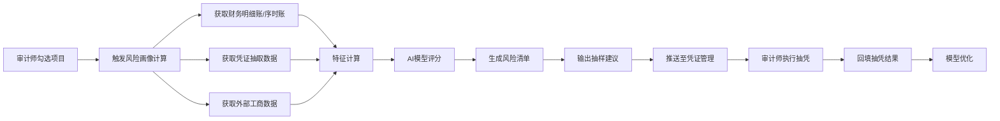

# 风险画像模块设计文档

## 1. 模块概述

### 1.1 背景与目标
在审计抽凭业务中，传统的抽样方式往往依赖审计师个人经验，缺乏系统性的风险识别与量化。风险画像模块旨在利用数据分析与AI技术，对选定审计项目（通过已有项目管理模块勾选）内的财务、业务及外部数据进行深度挖掘，构建多维度的风险指标体系，自动评估各科目、各交易的风险等级，并输出科学的抽样建议，从而提升审计效率与质量。

### 1.2 模块定位
- **输入**：审计师在风险画像模块中勾选单个项目，触发风险画像计算。
- **输出**：项目级风险热力图、科目风险排序、交易风险清单、抽样策略建议。
- **关联**：生成的抽样建议可直接推送至执行抽样模块，供审计师执行抽凭；抽凭结果可回填至本模块，形成风险模型闭环。

### 1.3 用户角色
- **审计师**：执行替代测试，查看风险画像，采纳抽样建议。
- **审计经理**：复核风险画像的合理性，调整风险参数。
- **系统管理员**：配置风险规则、模型版本。

---

## 2. 功能设计

### 2.1 项目风险概览
**功能描述**：以仪表盘形式展示所选项目的整体风险水平，帮助用户快速把握审计重点。

**子功能**：
- **风险总分**：综合各维度风险后给出的项目风险评分（0-100分）及等级（低/中/高）。
- **风险维度雷达图**：展示财务波动、交易对手、单据完整性、异常模式等维度的得分。
- **高风险科目TOP5**：按风险评分排序的科目列表，支持点击下钻。
- **风险趋势**：可选展示历史审计周期风险变化（若存在历史数据）。

### 2.2 多维风险画像
**功能描述**：从不同视角剖析风险分布，支持交叉筛选。

**子功能**：
- **科目维度**：
  - 展示各科目（如应收账款、收入、成本）的风险评分及主要异常指标。
  - 支持按金额、波动率、异常率排序。
- **交易对手维度**：
  - 客户/供应商列表，展示集中度、关联交易占比、工商异常标记。
  - 支持按交易额、风险评分排序。
- **时间维度**：
  - 月度/季度收入、费用波动图，标注异常月份。
  - 资产负债表日前后的交易分布，识别跨期风险。
- **单据完整性维度**：
  - 各交易类型的单据缺失率（如缺少合同、缺少物流单）。
  - 逻辑矛盾统计（金额不匹配、日期倒挂等）。

### 2.3 交易级风险清单
**功能描述**：列出所有明细交易（基于序时账或凭证列表），并附上风险评分及标签。

**子功能**：
- **风险评分**：每条交易综合风险得分。
- **风险标签**：如“大额关联方”“新客户异常增长”“缺物流单”“节假日交易”等。
- **高级筛选**：支持按风险等级、金额范围、日期、客户名称等条件筛选。
- **批量操作**：可将筛选出的高风险交易一键添加到抽凭清单（与凭证管理模块联动）。

### 2.4 抽样策略建议
**功能描述**：基于风险画像结果，自动生成抽样计划。

**子功能**：
- **分层抽样建议**：
  - 高风险层（风险分≥80）：建议100%检查。
  - 中风险层（60~79）：建议按比例抽取（如30%）。
  - 低风险层（<60）：建议按比例抽取（如5%）。
- **货币单元抽样建议**：按金额大小加权，自动计算样本量。
- **重点抽样建议**：自动圈定所有高风险标签的交易（如关联方、期末大额、新客户）。
- **样本量估算**：根据总体规模、可容忍错报、期望置信度等参数计算建议样本量。
- **导出抽样清单**：将抽样计划导出为Excel或直接推送到凭证管理模块。

### 2.5 参数配置与管理
**功能描述**：允许审计人员调整风险权重、阈值，并保存为模板。

**子功能**：
- **风险指标权重配置**：设置各维度（金额、关联方、账龄、完整性等）在风险评分中的权重。
- **阈值自定义**：定义高/中/低风险的评分区间。
- **规则开关**：启用/禁用某些风险规则（如“节假日交易”是否纳入计算）。
- **模板保存**：将当前配置保存为模板，供同类项目复用。

### 2.6 结果解释与导出
**功能描述**：提供风险画像的报告生成与解释功能，便于归档和汇报。

**子功能**：
- **生成风险分析报告**：PDF格式，包含所有图表、高风险清单、抽样建议。
- **导出数据**：支持导出风险清单Excel、科目风险表等。
- **底稿嵌入**：可将风险画像结果自动写入审计工作底稿。

---

## 3. 数据流与交互

### 3.1 与现有模块的交互
- **项目管理模块**：
  - 获取用户勾选的项目ID及基本信息。
  - 获取项目关联的财务期间、被审计单位信息。
- **凭证管理模块**：
  - 获取项目下已上传的凭证文件、抽取的结构化数据（合同、发票、物流单等）。
  - 将生成的抽样清单推送至凭证管理模块，作为抽凭任务。
  - 接收抽凭结果（有无错报、错报金额），用于风险模型的反馈优化。

### 3.2 数据流图


---

## 4. 界面设计（线框图说明）

### 4.1 项目选择页
- 展示项目列表，支持多选。
- 点击“生成风险画像”按钮，跳转至画像详情页。

### 4.2 风险画像详情页

**顶部栏**：
- 显示当前项目名称、期间。
- 刷新、导出报告、配置参数按钮。

**主体区域**（分为左右两栏）：

- **左侧（导航树）**：
  - 风险概览
  - 科目风险
  - 交易对手风险
  - 时间序列风险
  - 交易级风险清单
  - 抽样策略建议

- **右侧（内容区）**：
  - 根据左侧选择展示相应内容，各子页面包含图表、表格和操作按钮。

**关键组件示意**：
- **风险概览**：雷达图 + 风险总分卡片 + 高风险科目TOP5表格。
- **科目风险**：柱状图（各科目风险得分）+ 明细表格（科目名、金额、风险分、主要异常指标）。
- **交易级风险清单**：表格，列包含凭证号、日期、金额、客户名、风险分、风险标签、操作（加入抽凭清单）。支持筛选和排序。
- **抽样策略建议**：展示建议样本量、分层说明，提供“生成抽样清单”按钮，点击后弹出预览，确认后推送至凭证管理。

---

## 5. 技术实现

### 5.1 整体架构
- **后端**：Python + FastAPI，提供风险计算API。
- **前端**：React/Vue，与现有项目管理、凭证管理模块保持一致。
- **数据库**：DuckDB（存储风险计算结果、配置参数）。
- **计算引擎**：Celery异步任务（风险计算耗时较长）。
- **AI服务**：独立模型服务（如基于Scikit-learn、PyTorch），通过RESTful接口调用。

### 5.2 核心计算流程
1. **数据抽取**：
   - 从财务数据库读取所选项目的序时账、科目余额表、往来明细。
   - 从凭证管理模块获取已抽取的结构化数据（合同、发票、物流单等）。
   - 调用外部接口获取工商信息（可选）。

2. **特征工程**：
   - 科目层面：计算月度波动率、同比环比、异常金额占比、期末调整频次。
   - 交易对手层面：计算集中度、关联方比例、新客户占比、工商异常标记。
   - 单据完整性：合同/发票/物流单匹配率、逻辑矛盾数量。
   - 交易层面：金额是否超过重要性阈值、是否节假日、是否整数金额、是否重复。

3. **风险评分**：
   - 规则部分：将各指标按预设权重加权计算。
   - AI部分：调用预训练模型（如XGBoost）对交易打分。
   - 最终风险分 = α × 规则分 + (1-α) × 模型分（α可配置）。

4. **抽样建议生成**：
   - 根据风险分和金额，采用分层抽样或货币单元抽样算法。
   - 输出样本量及具体交易ID清单。

### 5.3 数据库表设计（核心）

#### risk_scores (风险评分结果表)
| 字段 | 类型 | 说明 |
|------|------|------|
| id | UUID | 主键 |
| project_id | UUID | 关联项目 |
| entity_type | String | 评分对象类型：科目/交易/客户/供应商 |
| entity_id | String | 对应ID（如科目代码、交易流水号） |
| risk_score | Float | 风险分数(0-100) |
| risk_level | String | 高/中/低 |
| risk_factors | JSON | 各维度得分详情 |
| created_at | DateTime | |
| version | Integer | 版本号，支持多版本比较 |

#### sampling_plans (抽样计划表)
| 字段 | 类型 | 说明 |
|------|------|------|
| id | UUID | |
| project_id | UUID | |
| plan_name | String | 计划名称 |
| strategy | String | 分层/货币单元/重点 |
| sample_transactions | JSON | 选中的交易ID列表 |
| total_sample_size | Integer | |
| generated_by | UUID | 用户 |
| created_at | DateTime | |

#### risk_config (风险配置表)
| 字段 | 类型 | 说明 |
|------|------|------|
| id | UUID | |
| config_name | String | 配置模板名称 |
| weights | JSON | 各指标权重 |
| thresholds | JSON | 高中低阈值 |
| rules_enabled | JSON | 规则开关 |
| is_default | Boolean | |

### 5.4 API设计（示例）

#### GET /api/projects/{project_id}/risk-profile
**功能**：获取指定项目的风险画像摘要。
**响应**：
```json
{
  "overall_score": 78,
  "overall_level": "中",
  "radar_data": {...},
  "top_risky_accounts": [...],
  "summary": {...}
}
```

#### GET /api/projects/{project_id}/risk-transactions
**功能**：获取交易级风险清单，支持分页、排序、筛选。
**参数**：risk_level, amount_min, amount_max, start_date, end_date, page, size

#### POST /api/projects/{project_id}/sampling-plan
**功能**：生成抽样计划。
**请求体**：
```json
{
  "strategy": "分层",
  "high_risk_ratio": 1.0,
  "medium_risk_ratio": 0.3,
  "low_risk_ratio": 0.05,
  "apply_to_audit_module": true
}
```
**响应**：返回计划ID及样本清单。

#### PUT /api/projects/{project_id}/risk-config
**功能**：更新风险配置（需权限）。
**请求体**：包含weights, thresholds等。

---

## 6. AI能力接入

### 6.1 异常交易检测
- **技术**：孤立森林（Isolation Forest）、自编码器（Autoencoder）
- **输入**：交易特征（金额、日期、客户、商品等）
- **输出**：异常得分（0-1），异常得分高的交易自动打标“异常模式”
- **接入方式**：作为特征输入到风险评分模型，或单独展示异常交易清单。

### 6.2 风险预测模型
- **技术**：XGBoost / LightGBM
- **训练数据**：历史审计项目的抽凭结果（交易是否被审计调整）
- **特征**：金额、账龄、客户类型、季节、单据完整性等
- **输出**：交易被调整的概率（作为风险评分的一部分）
- **更新**：每月/每季度用新增数据重训练

### 6.3 关联方识别
- **技术**：知识图谱 + 图神经网络
- **输入**：企业工商信息、交易对手名称、银行账户、股东信息
- **输出**：识别隐藏的关联方关系，对关联方交易提升风险权重
- **实现**：使用Neo4j存储图谱，定期更新，通过API返回关联标记

### 6.4 自然语言处理（可选）
- **场景**：对合同文本、审计底稿描述进行语义分析，提取风险关键词
- **技术**：BERT / 文本分类
- **输出**：风险标签（如“退货权”“对赌条款”）

---

## 7. 非功能性需求

| 需求 | 说明 |
|------|------|
| 性能 | 单个项目（交易量≤10万条）风险计算应在5分钟内完成；查询响应≤2秒 |
| 可扩展性 | 支持分布式计算（Celery集群），应对大型项目（百万级交易） |
| 数据安全 | 风险画像结果属于审计敏感数据，需严格控制访问权限（基于项目） |
| 可追溯性 | 记录每次风险计算的时间、使用的配置版本、AI模型版本 |
| 可解释性 | 每个风险分需附带详细因子得分，支持下钻查看原始数据 |

---

## 8. 验收标准

1. **功能完整性**：
   - 支持项目选择、风险概览展示、科目/交易对手/时间/交易级风险分析。
   - 可生成抽样计划并推送至凭证管理模块。
   - 参数配置可保存并生效。

2. **准确性**：
   - 风险评分结果与资深审计师判断的吻合度≥80%（通过测试用例验证）。
   - 抽样计划能有效覆盖已知高风险交易。

3. **性能**：
   - 10万条交易项目在标准配置下计算时间≤5分钟。
   - 并发用户10人，响应时间≤3秒。

4. **易用性**：
   - 界面操作流畅，图表交互友好。
   - 提供操作引导和帮助文档。

5. **集成性**：
   - 与项目管理、凭证管理模块无缝对接，数据流通正常。

---

## 9. 实施计划

| 阶段 | 内容 | 工期 |
|------|------|------|
| 第1周 | 数据接口开发、数据库表设计、基础API | 5天 |
| 第2周 | 特征工程实现（规则部分）、前端页面框架 | 5天 |
| 第3周 | 风险评分引擎、抽样算法、前后端联调 | 5天 |
| 第4周 | AI模型接入（异常检测、预测模型）、测试与优化 | 5天 |
| 第5周 | 参数配置功能、报告导出、用户验收测试 | 5天 |

---

## 10. 风险与应对

| 风险 | 应对措施 |
|------|----------|
| 数据质量问题（缺少关键字段） | 设计容错机制，缺失字段自动赋默认值并提示用户补充 |
| AI模型预测偏差 | 提供模型版本回滚机制；保留人工干预入口，允许调整风险分 |
| 计算性能瓶颈 | 采用异步任务+缓存，对大项目进行分片计算 |
| 用户不接受自动抽样 | 保留手动抽样功能，风险画像仅作为参考建议 |

---

## 11. 附录

### 11.1 术语表
- **风险画像**：基于多维度数据对项目风险进行的量化描述。
- **货币单元抽样**：将每一元金额视为一个抽样单元，金额越大的交易被抽中概率越高。
- **关联方交易**：企业与关联方之间的交易，通常需重点关注公允性。

### 11.2 参考标准
- 《中国注册会计师审计准则第1311号——对存货、诉讼和索赔、分部信息等特定项目获取审计证据的具体考虑》
- 《中国注册会计师审计准则第1131号——审计工作底稿》

---

**文档版本**：V1.0  
**最后更新**：2026-04-01  
**编写人**：审计产品组